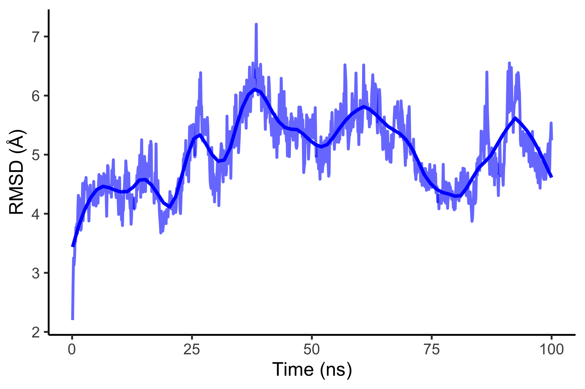

# Molecular Dynamics Analysis of Vaccine–Receptor Complexes

## Overview

This repository provides a reproducible workflow for the **pre-processing, post-processing, and visualization** of molecular dynamics (MD) simulations of vaccine–receptor complexes generated using GROMACS. The pipeline is designed to evaluate key structural properties including stability, flexibility, compactness, and hydrogen bonding behavior.

The workflow emphasizes modularity and reproducibility, enabling users to apply the same analysis pipeline to multiple simulation runs and complexes.

---

**Live workflow vignette:**  
https://vsgosnell.github.io/MD-Simulation-Analysis/


---

## Analyses Included

### Simulation Workflow (GROMACS)
- Structure preparation and topology generation (CHARMM → GROMACS conversion)
- Energy minimization  
- Equilibration (NVT/NPT)  
- Molecular Dynamics Production run  

### Trajectory Processing
- Combination of multiple MD trajectories  
- Extraction of Average Structures from Simulation Trajectories  

### Structural Analyses
- Root Mean Square Deviation (RMSD)  
- Root Mean Square Fluctuation (RMSF)  
- Radius of Gyration (Rg)  
- Intramolecular Hydrogen Bond Analysis  

### Structural Visualization & Post-Processing
- Electrostatic Surface Representations  
- Integrated Binding Mode Diagrams  

---

## Repository Structure

```
scripts/
  simulation/         # GROMACS simulation workflows
  post_processing/    # Trajectory processing & structure extraction
  analysis/           # R scripts for analysis and plotting

data/                 # Example processed datasets
plots/                # Example output figures
docs/                 # Detailed workflow & vignette

run_all.sh            # SLURM pipeline script
environment.yml       # Conda environment
```

---

## Tools and Software

- **GROMACS** — molecular dynamics simulations and trajectory analysis  
- **R** — data processing and statistical analysis  
- **ggplot2** — data visualization  
- **PyMOL** — structural visualization and figure generation  

---

## Data Availability

Full molecular dynamics trajectories (e.g., `.xtc`, `.trr`) and large simulation outputs are not included due to file size limitations and ongoing research considerations.

Representative processed datasets are provided in the `data/` directory to demonstrate the analysis workflow. Users may substitute their own GROMACS-generated outputs using the same input format.

---

## Reproducing the Analysis

### Note: The simulation and post-processing shell scripts are designed for execution on a SLURM-based HPC cluster with GROMACS 2020.4 and OpenMPI available through environment modules. These scripts may require modification for local workstations or non-SLURM systems.

---

### Simulation

Energy minimization and equilibration are performed sequentially within a single script, followed by the production runs:

```bash
bash scripts/simulation/minimization_equilibration.sh
bash scripts/simulation/production_run1.sh
bash scripts/simulation/production_run2.sh
```

---

### Run Complete Workflow

From the repository root:

```r
source("scripts/run_all.sh")
```

This script submits all simulation and post-processing jobs with proper dependencies.

---

## Run Individual Analyses

Each analysis can also be executed independently:

```r
source("scripts/analysis/plot_rmsd.R")
source("scripts/analysis/plot_rmsf.R")
source("scripts/analysis/plot_rg.R")
source("scripts/analysis/plot_hbonds.R")
```

---

### Local Analysis

The R analysis workflow can be run locally using the example processed datasets:

```r
source("scripts/analysis/run_analysis.R")
```

---


## Input Requirements

The workflow expects processed GROMACS output files (converted to `.csv`), derived from:

- RMSD (`gmx rms`)
- RMSF (`gmx rmsf`)
- Radius of gyration (`gmx gyrate`)
- Hydrogen bonds (`gmx hbond`)

---

Conversion from `.xvg` to `.csv` can be performed using:

```r
source("scripts/analysis/convert_xvg_to_csv.R")
```

---

## Example Output



---


## Documentation

Detailed step-by-step instructions for the full workflow, including `GROMACS` post-processing commands and analysis procedures, are provided at:

https://vsgosnell.github.io/MD-Simulation-Analysis/

---

## Citation

If you use or adapt this workflow, please cite this repository.

A formal manuscript describing this pipeline is currently in preparation.
